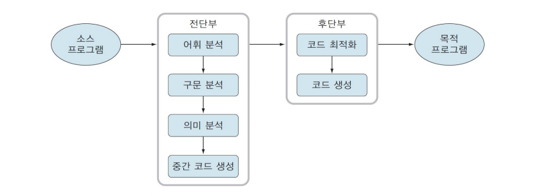
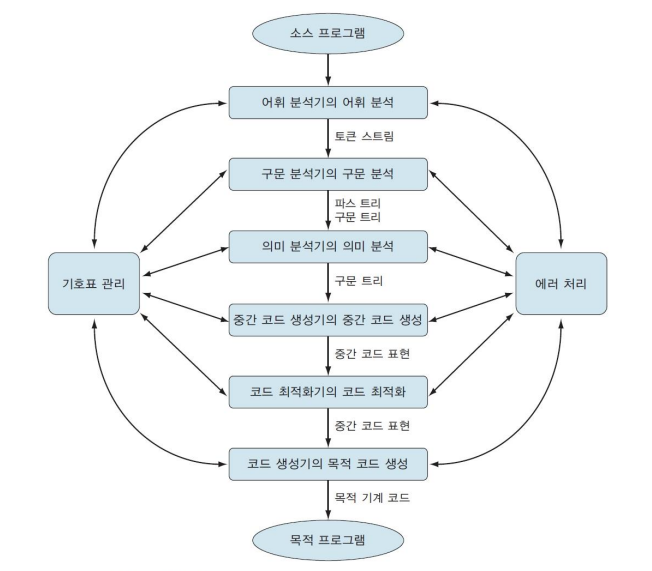

# 목차
- [Compiler](#compiler)
- [번역기(프리프로세서, 어셈블러, 인터프리터, 컴파일러)에 대한 정의](#번역기(프리프로세서,-어셈블러,-인터프리터,-컴파일러)에-대한-정의)
- [컴파일러의 필요성](#컴파일러의-필요성)
- [컴파일러의 논리적 구조](#컴파일러의-논리적-구조)

 

## Compiler
> - #### 정의
>   - 특정 프로그래밍 언어로 쓰여 있는 문서를 다른 프로그래밍 언어로 옮기는 **언어 번역 프로그램**입니다.
> - #### 사용 이유
>   - 대부분 사람에게 이해하기 쉬운 형태의 고수준 언어로부터 실행 가능한 기계어 프로그램을 만들기 위해서 사용됩니다.

 

## 번역기(프리프로세서, 어셈블러, 인터프리터, 컴파일러)에 대한 정의
> - #### 번역기 
>   - 하나의 프로그래밍 언어로 작성된 프로그램(소스 프로그램)을 그와 동등한 의미를 가진 다른 프로그래밍 언어로 된 프로그램(목적 프로그램)으로 변환하는 프로그램입니다.
> - #### 어셈블러
>   - 어셈블리어로 작성된 소스프로그램을 그에 대응하는 기계어로 번역된 목적 프로그램으로 번환해주는 번역기입니다.
> - #### 프리프로세서
>   - 전처리기라도 불리우며, 소스 프로그램과 목적 프로그램이 모두 고급 언어인 번역기로, 프로그래밍 언어에 유용한 기능을 추가하여 언어를 확장하는 역할을 합니다.
> - #### 인터프리터
>   - 다른 번역기들과 달리 번역과 동시에 실행됩니다. 
> 즉 고급 언어를 입력받아 번역과 동시에 실행한 뒤 그 결과를 출력합니다.
> - #### 컴파일러
>   - 인간이 사용하는 고급 언어를 기계어로 변환해주는 번역기입니다.

 

## 컴파일러의 필요성
> - 인간은 문제를 해결하기 위해 컴퓨터를 사용하며, 컴퓨터와 의사소통을 하는데
> 언어가 필요합니다. 컴퓨터는 기계어를 사용하지만 인간이 기계어를 사용하여 문제를
> 표현하기란 무척 어렵습니다. 그렇기에 인간은 사람 중심언어인 고급 언어를 사용합니다.
> 하지만 또 이 고급 언어는 컴퓨터가 이해하지 못합니다.  
> **따라서 인간이 사용하는 고급 언어를 기계어로 변환해주는 번역기인 컴파일러가 필요합니다.**
>

 

## 컴파일러의 논리적 구조
> - #### 논리적 구조를 설명하는 방법은 많지만 여기선 전단부와 후단부로 나누어 설명하겠습니다.
> - #### 전단부
>   - 목적 기계에 독립적인 부분으로 목적 기계에 관계없이 소스 프로그램을 분석하고 중간 코드를 생성합니다.
> - #### 후단부
>   - 목적 기계에 의존적인 부분으로 전단부에서 생성한 중간 코드를 특정 기계에 대한 목적 코드로 번역합니다.
> - #### 
> - #### 
> - #### 어휘 분석(스캐닝)
>   - 소스 프로그램을 읽어들여 토큰이라는 의미 있는 문법적 단위로 분리하여 토큰 스트림을 생성합니다.
> - #### 구문 분석(파싱)
>   - 토큰 스트림을 받아서 주어진 문법에 맞는지 검사하며, 주어진 문법에 맞는 문장의 경우 그 문장에 대한 파스 트리를 출력하고, 올바르지 않은 문장의 경우 에러메세지를 출력합니다.
> - #### 의미 분석
>   - 구문 트리와 기호표에 있는 정보를 이용하여 소스 프로그램이 언어 정의에 의미적으로 일치하는지를 검사하고, 다음 단계인 중간 코드 생성에 이용하기 위해 자료형 정보를 수집하여 구문 트리나 기호표에 저장합니다.
> - #### 중간 코드 생성
>   - 구문 트리를 이용하여 각 구문에 해당하는 중간 코드를 생성하거나 한 문법 규칙이 감축될 때마다 구문 지시적 번역이 이뤄집니다.
> - #### 코드 최적화
>   - 주어진 입력 프로그램과 의미적으로 동등하면서 좀 더 효율적인 코드로 바꾸어 코드 실행 시 기억 공간이나 실행 시간을 절약합니다.
> - #### 목적 코드 생성
>   - 연산을 수행할 레지스터를 선택하거나 자료에 메모리의 위치를 정해주며 실제로 목적 기계에 맞는 코드를 생성합니다.

 

## 형식 언어
