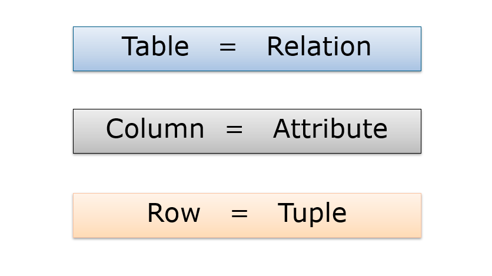
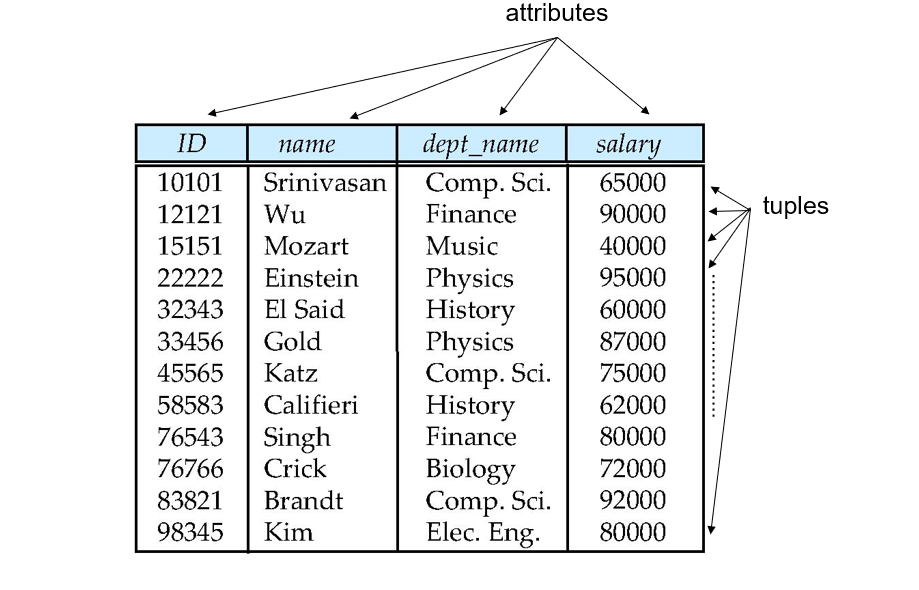

# 목차
- [Database](#database)
- [DBMS](#dbms)
- [DBMS 와 File System](#dbms--file-system)
- [관계형 데이터베이스](#관계형-데이터베이스)
- [Keys](#keys)
- [관계대수](#관계대수)

 

## Database
> - #### 정의 
>    - 다양한 사람이 공유하여 사용할 목적으로 체계화해 통합, 관리하는 **데이터의 집합**입니다.
>    - 데이터베이스는 아주 클 수도 있습니다.

 

## DBMS
> - #### DataBase Management System
> - #### 정의     
>   - 다수의 사용자들이 DB 내의 데이터를 접근할 수 있도록 해주는 소프트웨어입니다.
> - #### 특징      
>   - 데이터와 관련된 모든 작업 및 관리를 합니다. (추가/삭제/변경/검색 등등)
>   - 사용하기에 편리하고 효율적이어야 합니다.
>   - 그 종류로는 MySQL, Oracle, Postgres 등등이 있습니다.

 

## DBMS 와 File System
> - File System 으로 데이터베이스를 관리한다면
>   - 중복, 불일치, 접근의 어려움, 제약에 대한 어려움, 비원자성, 동시접근 문제, 보안에 취약 등등 
> 많은 단점이 있습니다.
> - 하지만 DBMS 로 관리한다면 위의 모든 문제를 해결할 수 있습니다. 

 

## 관계형 데이터베이스
> - #### 정의
>   - 관계형 데이터 모델에 기초를 둔 데이터베이스입니다.
> - #### 특징
>   - 관계형 데이터베이스는 다수의 테이블(table)의 모임으로 구성되어 있습니다.
>   - table 은 relation 이라고도 부르며, column(attribute), row(tuple) 를 갖고 있습니다.  
> - 
> - 
> - #### attribute 의 세 가지 속성
>   - 속성이 가질 수 있는 값의 데이터 타입을 정할 수 있습니다. (int, string 등등)
>   - atomic (원자적) 즉 더 이상 쪼갤 수 없습니다.
>   - null 값을 가질 수 있습니다.
> - #### Relation Schema
>   - Schema 는 고정적이며 변할 수 없습니다.
>   - R(A1, A2, A3) 에서 R 은 relation 이름, 괄호 안에 있는 것들은 attribute 입니다.
>   - R(A1, A2, A3)를 relation schema 라고 합니다.
> - #### Relation Instance
>   - 특정 시간에 데이터베이스에 있는 데이터입니다.
>   - schema 와는 달리 변경될 수 있습니다.
> - #### 나쁜 디자인의 relation 이 되지 않는 방법
>   - null 값은 사용하지 않는 것이 좋습니다.
>   - 중복값이 저장되어 있지 않아야 합니다.(정보 불일치 현상이 발생합니다.)
>   - 한 relation 에 모든 것을 넣는 설계는 좋은 설계가 아닙니다.

 

## Keys
> - #### 정의
>   - 하나의 tuple 을 다른 tuple 로부터 구별하는 방법입니다.
> - #### 종류
>   - super key, candidate key, primary key, foreign key.
> - #### super key
>   - 무조건 하나밖에 없는(uniquely) attribute 라면 그 컬럼, 즉 집합은 super key가 됩니다.
>   - 예를 들면, 주민등록번호, ID, email 등등이 있습니다.
>   - 사람의 이름이나 전공 이런 것들은 중복이 가능하기에 super key 가 될 수 없습니다.
> - #### candidate key
>   - super key 인데, 그 proper subset(공집합과 자기자신을 제외한 부분집합)이 super key 가 아닌 것입니다.
>   - 예를 들어, {ID, name}이 있는데 이 집합의 proper subset 은 {ID}와 {name}입니다. {ID}는 super key 이므로 {ID, name}는 candidate key 가 될 수 없습니다.
>   - proper subset 모두 super key 가 아니어야 하고 그것을 candidate key 라고 합니다.
>   - 물론 {ID}는 super key 이자 candidate key 입니다.
>   - 이러한 경우를 봅시다.
>   - {Building_name, room_number} 에서 이거 자체는 super key 입니다. 중복이 될 수 없기 때문이죠. 하지만 proper subset 들은 모두 중복들이 가능하기에 super key 가 아닙니다. 따라서 전체는 candidate key 입니다.
>   - #### candidate key 인지 확인하는 방법
>       - 우선 해당 {} 이 super key 인지 확인합니다.
>       - super key 가 아니라면 candidate key 가 될 수 없습니다.
>       - super key 라면 proper subset 을 확인합니다. subset 이 모두 super key 가 아니라면 {}는 candidate key 입니다.
> - #### primary key
>   - candidate key 중 하나입니다.
>   - primary key 에는 밑줄을 칩니다.
>   - 보통 DB 설계자가 선택합니다.
>   - PK 는 반드시 하나여야 합니다. 두 개에 밑줄이 쳐져 있다면, 두 개를 합쳐서 하나로 만든 것이 PK 라는 뜻입니다.
> - #### foreign key
>   - 다른 릴레이션의 PK 를 가져온 것입니다.
>   - 화살표로 외래키인지 표시합니다.
>   - PK <---- FK 이런 식으로 표기합니다.

 

## 관계대수
> - #### 정의
>   - 릴레이션에 수행하는 연산입니다.
> - #### 종류
>   - Selection(선택 연산)
>   - Projection(추출 연산)
>   - Natural Join(자연 조인)
>   - Cartesian Product(카티션 곱)
>   - Union(합집합)
>   - Intersection(교집합)
>   - Set Difference(차집합)
> - #### Selection(선택 연산)
>   - 선택 조건을 만족하는 relation 의 tuples 를 출력합니다.
>   - condition : `salary > $85,000`
>   - relation : 해당 relation
>   - salary 가 85,000 달러 이상인 튜플들만 반환합니다.
>   - and/or 연산자 사용가능
> - #### Projection(추출 연산)
>   - relation 에서 선택된 attributes 를 출력합니다.
>   - attribute-list : `salary`
>   - relation : 해당 relation
>   - 속성이 salary 인 튜플들만 반환합니다.
> - #### Natural Join(자연 조인)
>   - 같은 이름을 가지고 있는 attributes 에서 두 relations 이 같은 값을 가지고 있는 tuples 의 쌍을 출력합니다.
>   - relation1 과 relation2 가 필요함.
>   - 두 relation 에서 속성 이름 같은 것만 보고, 그 안에 tuple 까지 같은 것만 추출합니다.
>   - 새로운 relation 이 만들어집니다.
>   - ##### 자연 조인 중 같은 속성이 없다면...
>       - 이런 경우, 두 relation 을 카티션 곱해줍니다.
> - #### Cartesian product(카티션 곱)
>   - 두 relation 부터 가능한 모든 tuple 의 쌍을 출력합니다.
>   - 굳이 속성 이름이 같은 것이 있지 않아도 됩니다.
>   - ##### 카티션 프로덕트 중 attribute 가 같다면..
>       - 예를 들어 r1, r2의 `B`속성이 같다고 가정합니다.
>       - 새로 만들어지는 r3에는 `B`만 쓰지 않고, `r1B`,`r2B` 로 나눠서 써줍니다.
> - #### Union(합집합)
>   - 두 relation 의 tuple 에 대해서 합집합을 수행합니다.
>   - r1에 있는 모든 tuple 을 반환하고, r2에선 중복되지 않은 것만 반환합니다.
> - #### intersection(교집합)
>   - r1, r2가 둘 다 가진 것만 반환합니다.
> - #### Set difference(차집합)
>   - 같은 것이 있다면 없애고, 좌에만 존재하는 건 적어줍니다.
> - #### 집합들에서 속성이 서로 다른게 있다면..
>   - 집합에선 두 릴레이션의 속성이 무조건 같아야 합니다.
>   - 두개의 속성이 아주 같아야지만 set 연산이 가능합니다.

 

## SQL
> - #### Structured Query Language
> - #### 정의
>   - RDBMS 의 데이터를 관리하기 위해 설계된 특수 목적의 프로그래밍 언어입니다.
> - #### SQL 데이터 타입
>   - char(n) : 고정된 길이의 문자열입니다.
>   - varchar(n) : 가변 길이의 문자열입니다.
>   - int : 정수입니다.
>   - smallint : int 보다 더 작은 정수입니다.
>   - numeric(d,p) : 소숫점을 나타낼 수 있습니다.
>       - numeric(7,3) : 0000.000
>   - real, double : 실수를 나타냅니다.
> - #### SQL 식 종류
>   - create table
>   - drop table 
>   - alter table 
>   - select
>   - from
>   - where
>   - distinct
>   - natural join
>   - as
>   - like(%,_)
>   - order by(desc, asc)
>   - between
>   - union(all)
>   - intersect
>   - except
>   - is null
>   - avg, sum, min, max, count
>   - group by
>   - having
>   - in/not in
>   - some/all
>   - exists/not exists
>   - delete from
>   - insert into
>   - update set

 

## CREATE TABLE